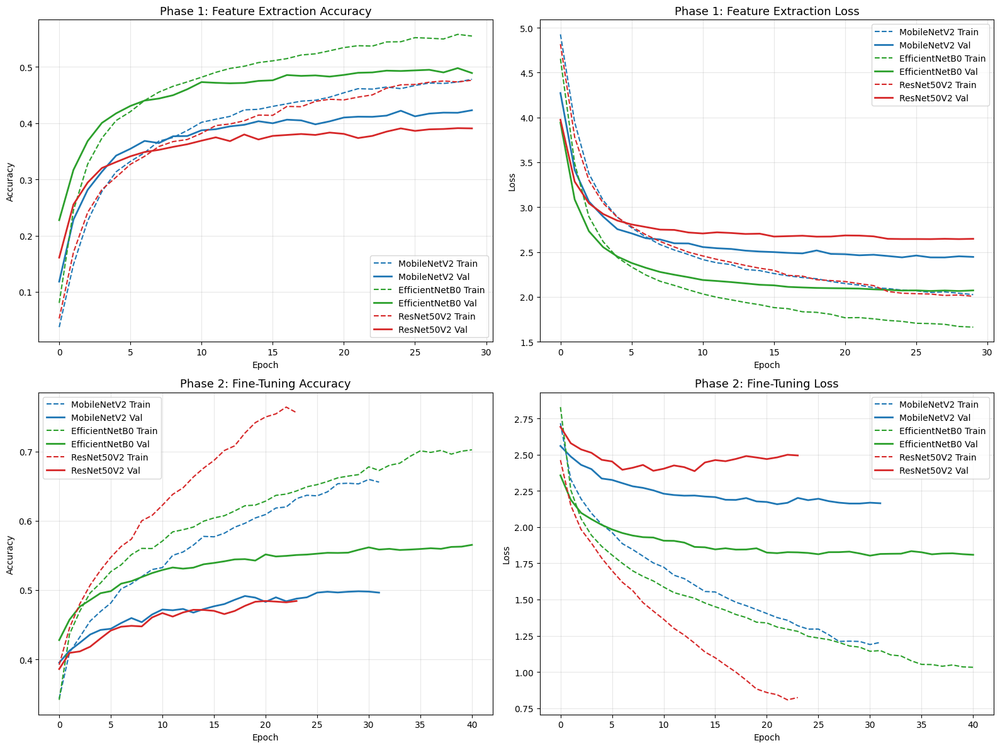
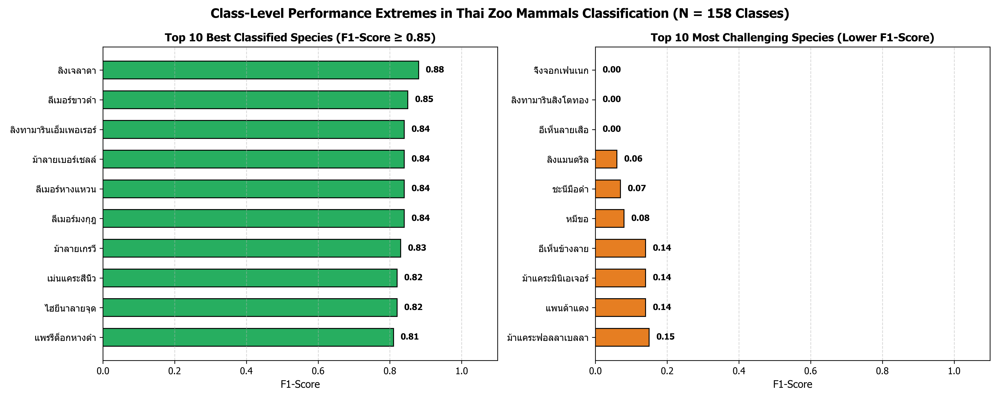
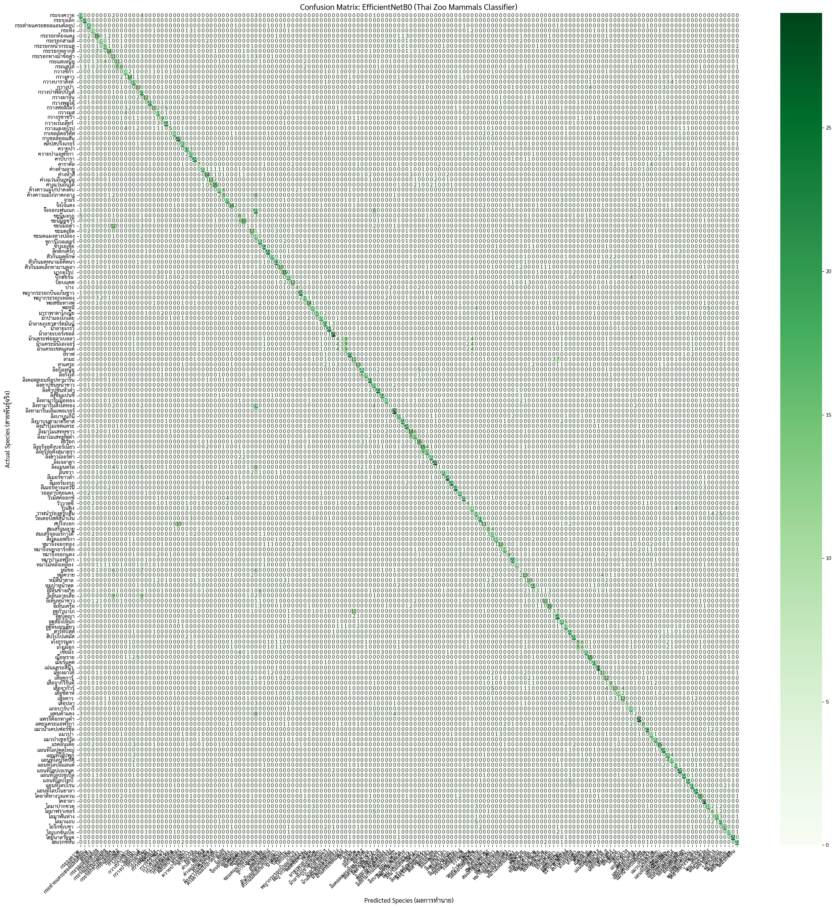
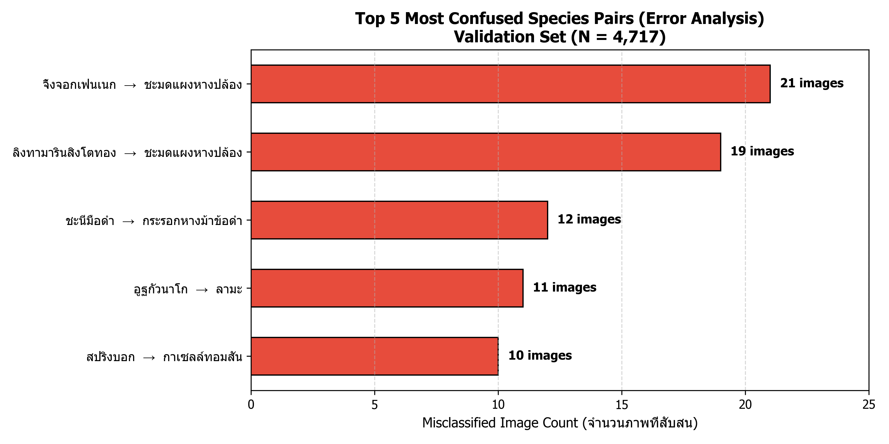
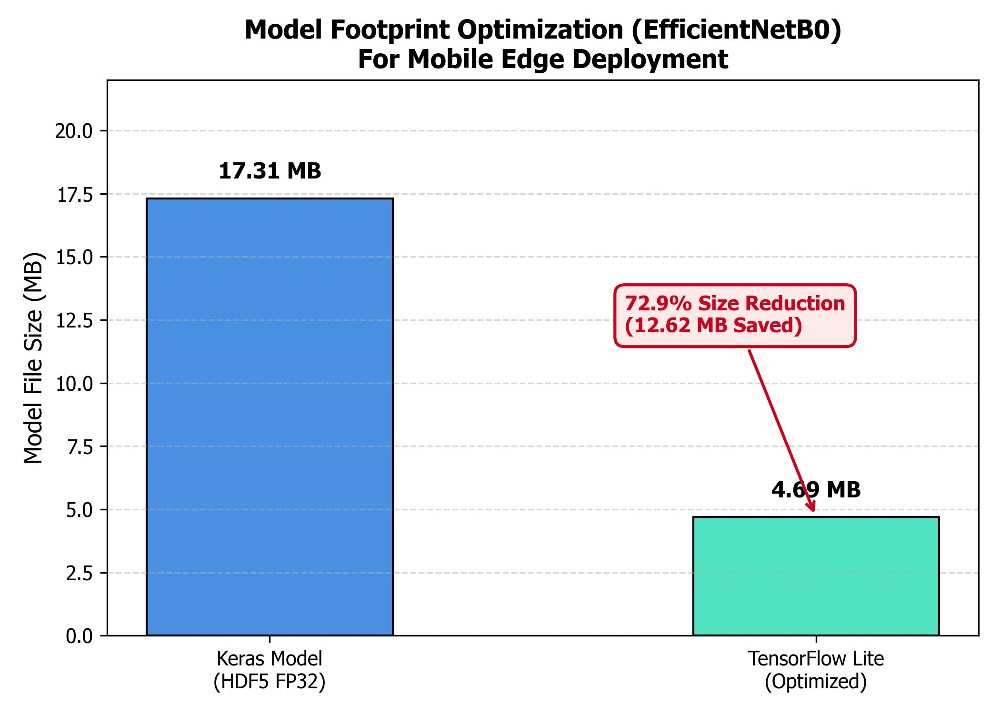

# บทที่ 4
# ผลการวิจัยและการอภิปรายผล

---

## 4.1 ผลการพัฒนาโมเดลปัญญาประดิษฐ์โครงข่ายประสาทเทียมเชิงลึก (Deep Neural Network - DNN) วิเคราะห์และจำแนกสัตว์จากภาพถ่าย

ในการศึกษาวิจัยนี้ ผู้วิจัยได้ดำเนินการพัฒนาและประเมินประสิทธิภาพของโมเดลการเรียนรู้เชิงลึก (Deep Learning) สำหรับการจำแนกชนิดพันธุ์สัตว์เลี้ยงลูกด้วยนมในสวนสัตว์ไทยจำนวน 162 สายพันธุ์ จากภาพถ่าย โดยใช้แนวคิดการถ่ายโอนการเรียนรู้แบบสองเฟส (Two-Phase Transfer Learning) ร่วมกับการเปรียบเทียบสถาปัตยกรรมโครงข่ายประสาทเทียมคอนโวลูชัน (Convolutional Neural Networks - CNNs) ชั้นนำ 3 สถาปัตยกรรม ได้แก่ **MobileNetV2**, **EfficientNetB0** และ **ResNet50V2** ตลอดจนการบีบอัดโมเดลเพื่อรองรับการประมวลผลบนอุปกรณ์พกพาและระบบเว็บแบบเรียลไทม์ โดยมีผลการทดสอบและรายละเอียดดังนี้

---

### 4.1.1 ภาพรวมชุดข้อมูลและการเตรียมข้อมูลสำหรับการฝึกสอน (Dataset & Preprocessing)

จากการรวบรวมข้อมูลทั้งหมด พบว่ามีข้อมูลสัตว์เลี้ยงลูกด้วยนมในสวนสัตว์ไทยจำนวน 250 ชนิด ผู้วิจัยได้คัดเลือกชนิดสัตว์ที่มีจำนวนภาพเพียงพอต่อการพัฒนาโมเดลและมีความสมบูรณ์ของข้อมูลจากฐานข้อมูลความหลากหลายทางชีวภาพระดับโลก (Global Biodiversity Information Facility - GBIF API) จำนวน **162 ชนิด** คิดเป็นจำนวนภาพรวมทั้งสิ้น **23,674 ภาพ** โดยแบ่งข้อมูลออกเป็น 2 ชุด ได้แก่:
1. **ชุดข้อมูลสำหรับฝึกสอนโมเดล (Training Set)**: จำนวน 18,957 ภาพ คิดเป็นร้อยละ 80 ของข้อมูลทั้งหมด
2. **ชุดข้อมูลสำหรับตรวจสอบความถูกต้อง (Validation Set)**: จำนวน 4,717 ภาพ คิดเป็นร้อยละ 20 ของข้อมูลทั้งหมด

#### เทคนิคการประมวลผลและเพิ่มขยายชุดข้อมูล (Data Preprocessing & Augmentation)
* **Letterbox Resizing**: ปรับขนาดภาพถ่ายให้อยู่ในขนาดมาตรฐาน $224 \times 224$ พิกเซล โดยคงอัตราส่วนดั้งเดิม (Aspect Ratio) และเติมขอบว่างเพื่อป้องกันการบิดเบี้ยวของลักษณะสัณฐานสัตว์
* **Pixel Normalization**: ปรับสเกลค่าความสว่างของพิกเซลให้อยู่ในช่วง $[0, 1]$ หรือ $[-1, 1]$ ตามข้อกำหนดของแต่ละสถาปัตยกรรม
* **Data Augmentation**: ใช้การสุ่มแปลงภาพขณะฝึกสอน ได้แก่ การหมุนภาพแบบสุ่ม (Rotation $\pm 20^\circ$), การเลื่อนตำแหน่งแนวนอน/แนวตั้ง (Shift $\pm 10\%$), การซูมภาพ (Zoom $\pm 10\%$), การปรับระดับความสว่าง (Brightness $[0.9, 1.1]$) และการพลิกภาพแนวนอน (Horizontal Flip)

---

### 4.1.2 โครงสร้างโมเดล (Model Architecture)

ผู้วิจัยได้ออกแบบระบบการสร้างแบบจำลองการเรียนรู้แบบถ่ายโอน (Dynamic Transfer Learning Model Building) เพื่อเปรียบเทียบประสิทธิภาพของโครงสร้างโครงข่ายประสาทเทียมคอนโวลูชัน (Convolutional Neural Networks: CNN) 3 รูปแบบ โดยทุกโมเดลจะถูกสร้างขึ้นภายใต้โครงสร้างมาตรฐานเดียวกัน (Unified Architecture) เพื่อให้ผลการทดลองมีความเที่ยงตรง ดังนี้

#### 4.1.2.1 การเลือกใช้โครงข่ายพื้นฐาน (Base Models)
ประยุกต์ใช้เทคนิคการเรียนรู้แบบถ่ายโอน (Transfer Learning) โดยนำโมเดลที่ผ่านการฝึกฝนล่วงหน้า (Pre-trained Models) บนชุดข้อมูลมาตรฐาน ImageNet มาทำหน้าที่เป็นส่วนสกัดคุณลักษณะเด่น (Feature Extractor) จำนวน 3 สถาปัตยกรรม ได้แก่:
1. **MobileNetV2**: สถาปัตยกรรมขนาดกะทัดรัด (Lightweight) ที่ใช้โครงสร้าง Depthwise Separable Convolution เพื่อลดทอนจำนวนพารามิเตอร์และการคำนวณ เหมาะสำหรับการประมวลผลบนอุปกรณ์พกพาและระบบ Edge
2. **EfficientNetB0**: ใช้หลักการสเกลแบบผสมผสาน (Compound Scaling) เพื่อปรับสมดุลความลึก (Depth) ความกว้างของช่องสัญญาณ (Width) และความละเอียดของภาพ (Resolution) อย่างมีประสิทธิภาพสูงสุดต่อจำนวนพารามิเตอร์
3. **ResNet50V2**: ใช้โครงสร้างการเชื่อมต่อแบบข้ามชั้น (Residual Learning / Skip Connections) เพื่อลดปัญหาความชันของการเกรเดียนต์สูญหาย (Vanishing Gradient) ทำให้โมเดลสามารถเรียนรู้ฟีเจอร์ที่มีมิติลึกและซับซ้อนได้ดี

#### 4.1.2.2 โครงสร้างเลเยอร์ภายในฟังก์ชัน (Layer Pipeline)
ทุกโมเดลที่ถูกสร้างผ่านฟังก์ชัน `build_transfer_learning_model` จะประกอบด้วยลำดับเลเยอร์ที่เหมือนกัน 4 ส่วนหลัก:
1. **Input Layer**: กำหนดขนาดรูปภาพขาเข้าที่ $224 \times 224 \times 3$ พิกเซล
2. **Pre-processing Layer (Rescaling)**: ใช้ `layers.Rescaling` ทำหน้าที่ปรับสเกลค่าพิกเซลให้สอดคล้องกับข้อกำหนดเฉพาะของแต่ละโมเดล (สเกลค่าให้อยู่ในช่วง $[-1, 1]$ สำหรับ MobileNetV2 / ResNet50V2 หรือ $[0, 255]$ สำหรับ EfficientNetB0)
3. **Feature Extraction Layer (Base Model)**: โครงข่ายหลักที่ผ่านการ Pre-train จาก ImageNet โดยในเฟสแรกจะทำการตรึงค่าน้ำหนัก (Freeze Weights: `trainable = False`) เพื่อคงคุณลักษณะพื้นฐาน และปลดล็อกในเฟสที่สองสำหรับการปรับจูนละเอียด (Fine-Tuning)
4. **Classification Head (Top Layers)**: ออกแบบส่วนหัวจำแนกประเภทใหม่สำหรับจำแนกสัตว์เลี้ยงลูกด้วยนม ประกอบด้วย:
   - **Global Average Pooling 2D (GAP)**: รวมและลดทอนมิติเชิงพื้นที่ของ Spatial Feature Maps ให้เหลือเวกเตอร์ 1 มิติ ช่วยลดจำนวนพารามิเตอร์และป้องกัน Overfitting
   - **Dropout Layer**: กำหนดอัตราสุ่มตัดการทำงานที่ 0.5 (50%) เพื่อลดการพึ่งพิงกันของนิวรอนและเพิ่มความทนทานของโมเดล
   - **Fully-Connected Dense Layer**: ขนาด 256 นิวรอน พร้อมฟังก์ชันกระตุ้นแบบ ReLU เพื่อเรียนรู้การรวมคุณลักษณะขั้นสูงก่อนจำแนก
   - **Output Dense Layer**: กำหนดขนาด 162 นิวรอน ตามจำนวนชนิดพันธุ์สัตว์ที่ศึกษา ใช้ฟังก์ชันกระตุ้นแบบ Softmax เพื่อแปลงผลลัพธ์เป็นค่าความน่าจะเป็น (Probability Distribution) ของแต่ละสายพันธุ์

---

### 4.1.3 การตั้งค่าตัวแปรเสริมในการฝึกสอน (Hyperparameter Settings)

เพื่อให้การฝึกสอนแบบจำลองปัญญาประดิษฐ์ทั้ง 3 สถาปัตยกรรมดำเนินไปอย่างมีเสถียรภาพและได้ผลการเปรียบเทียบที่แม่นยำ ผู้วิจัยได้กำหนดตัวแปรเสริม (Hyperparameters) ที่เป็นมาตรฐานเดียวกัน ดังนี้:
1. **ตัวปรับแต่งค่าความเหมาะสม (Optimizer)**: เลือกใช้ **Adam Optimizer** (Adaptive Moment Estimation) ซึ่งสามารถปรับเปลี่ยนอัตราการเรียนรู้สำหรับแต่ละพารามิเตอร์แบบอัตโนมัติ (Adaptive Learning Rate) ช่วยให้โมเดลค้นหาจุดลู่เข้าสู่ค่าต่ำสุดได้อย่างรวดเร็วและมีเสถียรภาพ
2. **อัตราการเรียนรู้แบบสองเฟส (Two-Phase Learning Rate)**: 
   - **เฟสที่ 1 (Feature Extraction)**: กำหนดอัตราการเรียนรู้เริ่มต้นที่ **$0.0001$ ($10^{-4}$)** ซึ่งเหมาะสมสำหรับการฝึกสอนเฉพาะส่วน Classification Head โดยไม่กระทบโครงข่ายหลัก
   - **เฟสที่ 2 (Fine-Tuning)**: ปรับลดอัตราการเรียนรู้ลงมาที่ **$0.00001$ ($10^{-5}$)** เพื่อค่อย ๆ ปรับจูนค่าน้ำหนักทุกเลเยอร์ร่วมกันอย่างระมัดระวัง ควบคู่กับ **`ReduceLROnPlateau`** ซึ่งจะปรับลดอัตราการเรียนรู้ลงเป็น $2 \times 10^{-6}$ โดยอัตโนมัติเมื่อค่าความสูญเสียไม่ลดลงติดต่อกัน 3 รอบ
3. **ขนาดของกลุ่มข้อมูล (Batch Size)**: กำหนดขนาดของกลุ่มข้อมูลไว้ที่ **16 ภาพต่อรอบการคำนวณ (Batch Size = 16)**
4. **จำนวนรอบในการฝึกสอนและระบบควบคุม (Epochs & Callbacks)**: 
   - กำหนดไว้ที่ **30 Epochs ในเฟสแรก** และ **50 Epochs ในเฟสที่สอง**
   - ใช้ **`ModelCheckpoint`** บันทึกเฉพาะโมเดลที่มีค่าความแม่นยำสูงสุด และ **`EarlyStopping`** หยุดการฝึกสอนเมื่อค่า Validation Loss ไม่พัฒนาเพื่อป้องกัน Overfitting
5. **ฟังก์ชันความสูญเสีย (Loss Function)**: ใช้ **Categorical Crossentropy** สำหรับการจำแนกชนิดพันธุ์สัตว์ 162 คลาส

---

### 4.1.4 ผลการเปรียบเทียบประสิทธิภาพระหว่างสถาปัตยกรรมโมเดล (Training Comparison)

การฝึกสอนโมเดลดำเนินการภายใต้สภาวะแวดล้อมที่ควบคุมด้วยฮาร์ดแวร์ GPU เร่งความเร็ว โดยมีผลการทดสอบเปรียบเทียบประสิทธิภาพของทั้ง 3 สถาปัตยกรรม ดังแสดงในตารางที่ 4.1 และรูปภาพที่ 4.1

#### ตารางที่ 4.1 ผลการเปรียบเทียบประสิทธิภาพของสถาปัตยกรรมโมเดล Deep Learning ในแต่ละเฟส

| สถาปัตยกรรมโมเดล (Architecture) | ความแม่นยำสูงสุด เฟสที่ 1 (Phase 1 Val Accuracy) | ความแม่นยำสูงสุด เฟสที่ 2 (Phase 2 Val Accuracy) | ค่าความสูญเสียต่ำสุด เฟสที่ 2 (Phase 2 Min Val Loss) | อัตราความแม่นยำเพิ่มขึ้น (Accuracy Gain) |
| :--- | :---: | :---: | :---: | :---: |
| **MobileNetV2** | 42.27% | 49.82% | 2.1578 | +7.55% |
| **EfficientNetB0** | **49.76%** | **56.52%** | **1.8028** | **+6.76%** |
| **ResNet50V2** | 39.09% | 48.42% | 2.3864 | +9.33% |

*รูปที่ 4.1 กราฟเปรียบเทียบค่าความแม่นยำ (Accuracy) และค่าความสูญเสีย (Loss) ตลอดการฝึกสอนทั้ง 2 เฟส ระหว่าง MobileNetV2, EfficientNetB0 และ ResNet50V2*

#### การวิเคราะห์ผลการเปรียบเทียบสถาปัตยกรรม:
1. **EfficientNetB0** ให้ประสิทธิภาพสูงสุดในทุกตัวชี้วัด โดยทำความแม่นยำบนชุดข้อมูลตรวจสอบได้ถึง **56.52%** และมีค่า Validation Loss ต่ำที่สุดที่ **1.8028** เนื่องด้วยสถาปัตยกรรมการสเกลแบบผสมผสาน (Compound Scaling Method) ที่ปรับสมดุลทั้งความลึก (Depth), ความกว้าง (Width) และความละเอียดภาพ (Resolution) อย่างมีประสิทธิภาพ ทำให้จับคู่ฟีเจอร์ที่มีความซับซ้อนของสิ่งมีชีวิตได้ดีกว่า
2. **MobileNetV2** ได้ความแม่นยำในเฟสที่สองที่ **49.82%** และ Loss **2.1578** ซึ่งมีข้อได้เปรียบด้านจำนวนพารามิเตอร์ที่น้อยและการประมวลผลที่รวดเร็ว เหมาะกับอุปกรณ์ทรัพยากรจำกัด แต่ความสามารถในการสกัดฟีเจอร์ที่มีความคล้ายคลึงกันสูงระหว่างสายพันธุ์ยังต่ำกว่า EfficientNet
3. **ResNet50V2** ได้ความแม่นยำ **48.42%** และ Loss **2.3864** แม้จะมีโครงสร้าง Residual Connections ที่ลึก แต่พบว่าเกิดภาวะ Overfitting บนชุดข้อมูลที่มีความหลากหลายของฉากหลังธรรมชาติได้ง่ายกว่า

จากการทดลอง จึงได้คัดเลือก **EfficientNetB0** เป็นโมเดลหลักสำหรับระบบจำแนกสัตว์เลี้ยงลูกด้วยนมในงานวิจัยนี้

---

### 4.1.5 การประเมินประสิทธิภาพเชิงลึกและการวิเคราะห์รายสายพันธุ์ (Per-Species Performance Analysis)

ผลการประเมินประสิทธิภาพของโมเดล EfficientNetB0 ที่ผ่านการ Fine-Tuned บนชุดข้อมูลตรวจสอบ (Validation Set) จำนวน 4,717 ตัวอย่าง ครอบคลุม 162 คลาสสายพันธุ์ สรุปได้ดังตารางที่ 4.2 ตารางที่ 4.3 ตารางที่ 4.4 และรูปภาพที่ 4.2 - 4.3

#### ตารางที่ 4.2 สรุปตัวชี้วัดประสิทธิภาพโดยรวม (Overall Classification Summary)

| ตัวชี้วัดประสิทธิภาพ (Metric) | ค่าความแม่นยำระดับมหภาค (Macro Average) | ค่าความแม่นยำถ่วงน้ำหนัก (Weighted Average) | ค่ารวมทั้งหมด (Overall) |
| :--- | :---: | :---: | :---: |
| **Top-1 Accuracy** | - | - | **56.00% (0.56)** |
| **Precision** | 0.56 | 0.56 | 0.56 |
| **Recall** | 0.56 | 0.56 | 0.56 |
| **F1-Score** | **0.55** | **0.55** | **0.55** |
| **จำนวนตัวอย่างทดสอบ (Support)** | 4,717 ภาพ | 4,717 ภาพ | 4,717 ภาพ |

*รูปที่ 4.2 อันดับสายพันธุ์สัตว์เลี้ยงลูกด้วยนมที่มีค่าความแม่นยำ F1-Score สูงสุดของโมเดล EfficientNetB0*

#### ตารางที่ 4.3 10 อันดับสายพันธุ์สัตว์ที่มีค่าความแม่นยำ F1-Score สูงสุด (Top 10 Performing Species)

| อันดับ | ชื่อสายพันธุ์สัตว์ | ค่าความแม่นยำ (Precision) | ค่าการตรวจพบ (Recall) | F1-Score | จำนวนตัวอย่าง (Support) |
| :---: | :--- | :---: | :---: | :---: | :---: |
| 1 | **ลิงเจลาดา** (*Theropithecus gelada*) | 0.82 | 0.93 | **0.88** | 30 |
| 2 | **ลีเมอร์ขาวดำ** (*Varecia variegata*) | 0.84 | 0.87 | **0.85** | 30 |
| 3 | **ลิงทามารินเอ็มเพอเรอร์** (*Saguinus imperator*) | 0.72 | **1.00** | **0.84** | 29 |
| 4 | **ม้าลายเบอร์เชลล์** (*Equus quagga burchellii*) | 0.74 | 0.97 | **0.84** | 30 |
| 5 | **ลีเมอร์หางแหวน** (*Lemur catta*) | 0.89 | 0.80 | **0.84** | 30 |
| 6 | **ลีเมอร์มงกุฎ** (*Eulemur coronatus*) | **0.89** | 0.80 | **0.84** | 30 |
| 7 | **ม้าลายเกรวี** (*Equus grevyi*) | 0.86 | 0.80 | **0.83** | 30 |
| 8 | **เม่นแคระสี่นิ้ว** (*Atelerix albiventris*) | 0.75 | 0.90 | **0.82** | 30 |
| 9 | **ไฮยีนาลายจุด** (*Crocuta crocuta*) | 0.81 | 0.83 | **0.82** | 30 |
| 10 | **แพรรีด็อกหางดำ** (*Cynomys ludovicianus*) | 0.69 | 0.97 | **0.81** | 30 |

#### ตารางที่ 4.4 10 อันดับสายพันธุ์สัตว์ที่โมเดลเกิดความสับสนสูง (Bottom 10 Species & Challenges)

| อันดับ | ชื่อสายพันธุ์สัตว์ | Precision | Recall | F1-Score | จำนวนตัวอย่าง (Support) |
| :---: | :--- | :---: | :---: | :---: | :---: |
| 1 | **จิ้งจอกเฟนเนก** (*Vulpes zerda*) | 0.00 | 0.00 | **0.00** | 30 |
| 2 | **ลิงทามารินสิงโตทอง** (*Leontopithecus rosalia*) | 0.00 | 0.00 | **0.00** | 29 |
| 3 | **อีเห็นลายเสือ** (*Prionodon pardicolor*) | 0.00 | 0.00 | **0.00** | 24 |
| 4 | **ลิงแมนดริล** (*Mandrillus sphinx*) | 0.20 | 0.03 | **0.06** | 29 |
| 5 | **ชะนีมือดำ** (*Hylobates agilis*) | 0.12 | 0.05 | **0.07** | 21 |
| 6 | **หมีขอ** (*Arctictis binturong*) | 0.11 | 0.07 | **0.08** | 29 |
| 7 | **อีเห็นข้างลาย** (*Paradoxurus hermaphroditus*) | 0.23 | 0.10 | **0.14** | 30 |
| 8 | **ม้าแคระมินิเอเจอร์** (*Miniature horse*) | 0.23 | 0.10 | **0.14** | 30 |
| 9 | **แพนด้าแดง** (*Ailurus fulgens*) | 0.33 | 0.09 | **0.14** | 22 |
| 10 | **ม้าแคระฟอลลาเบลลา** (*Falabella*) | 0.17 | 0.13 | **0.15** | 30 |

*รูปที่ 4.3 เมทริกซ์ความสับสน (Confusion Matrix) แสดงความสัมพันธ์ระหว่างคลาสจริงและคลาสที่โมเดลทำนาย ครบทั้ง 162 ชนิดพันธุ์*

---

### 4.1.6 การวิเคราะห์ข้อผิดพลาดและความสับสนระหว่างคลาส (Error Analysis & Top Confusions)

จากการวิเคราะห์เมทริกซ์ความสับสน (Confusion Matrix) พบข้อผิดพลาดหลักที่เกิดขึ้นบ่อยที่สุด 5 ลำดับแรก ดังแสดงในตารางที่ 4.5 และรูปภาพที่ 4.4

#### ตารางที่ 4.5 ลำดับข้อผิดพลาดสูงสุดและการวิเคราะห์สาเหตุเชิงชีววิทยาและภาพถ่าย (Top 5 Confused Pairs)

| ลำดับ | สายพันธุ์จริง (Actual Species) | โมเดลทำนายเป็น (Predicted Species) | จำนวนครั้งที่สับสน (Errors) | การวิเคราะห์สาเหตุและลักษณะทางกายภาพ (Morphological & Visual Notes) |
| :---: | :--- | :--- | :---: | :--- |
| **1** | **จิ้งจอกเฟนเนก** | ชะมดแผงหางปล้อง | 21 | สัตว์ขนาดเล็กในสภาพแวดล้อมรกทึบ มีสัดส่วนใบหูและโครงสร้างลำตัวใกล้เคียงกันเมื่อถ่ายจากระยะไกล |
| **2** | **ลิงทามารินสิงโตทอง** | ชะมดแผงหางปล้อง | 19 | ขนสีส้มทองและพวงหางที่ยาวถูกโมเดลจับคู่กับฟีเจอร์แถบลายหางของชะมดแผงหางปล้อง |
| **3** | **ชะนีมือดำ** | กระรอกหางม้าข้อดำ | 12 | สัตว์ที่มีขนสีดำสนิท อาศัยอยู่บนต้นไม้ในพุ่มไม้ทึบ (Dense foliage) ทำให้ฟีเจอร์โครงร่างกลืนไปกับพื้นหลัง |
| **4** | **อูฐกัวนาโก** | ลามะ | 11 | เป็นสัตว์ในวงศ์อูฐ (Camelidae) ที่มีความใกล้ชิดทางพันธุกรรม มีโครงหน้า ขน และสรีระใกล้เคียงกันมาก |
| **5** | **สปริงบอก** | กาเซลล์ทอมสัน | 10 | เป็นแอนทิโลปขนาดเล็กที่มีแถบสีข้างลำตัวและลวดลายแถบหน้าผากทับซ้อนกันอย่างมาก |

*รูปที่ 4.4 ลำดับคู่สายพันธุ์สัตว์ที่โมเดลเกิดข้อผิดพลาดในการทำนายสับสนสูงสุด (Top Confused Species Pairs)*

---

### 4.1.7 การปรับแต่งและบีบอัดโมเดลเพื่อการติดตั้งใช้งานจริง (Model Optimization & Edge Quantization)

เพื่อให้โมเดลสามารถนำไปติดตั้งใช้งานบนสมาร์ตโฟน แท็บเล็ต หรือประมวลผลบนเว็บเบราว์เซอร์ผ่านระบบ Edge AI ได้อย่างรวดเร็ว ผู้วิจัยได้นำโมเดล **EfficientNetB0** ที่ดีที่สุดมาผ่านกระบวนการแปลงและลดทอนความแม่นยำ (Post-Training Quantization - PTQ) ให้อยู่ในรูปแบบ **TensorFlow Lite (`.tflite`)**

#### ตารางที่ 4.6 ผลการเปรียบเทียบขนาดไฟล์และสภาพแวดล้อมการประมวลผล

| ขั้นตอนโมเดล (Model Stage) | รูปแบบไฟล์ (Format) | ชื่อไฟล์ (Filename) | ขนาดไฟล์ (File Size) | อัตราการลดขนาด (Reduction) | สภาพแวดล้อมเป้าหมาย (Target Runtime) |
| :--- | :---: | :---: | :---: | :---: | :--- |
| **ก่อนบีบอัด (Pre-quantization)** | Keras H5 (FP32) | `mammals_best_model.h5` | 17.31 MB | 0.00% (ฐานอ้างอิง) | เซิร์ฟเวอร์ / GPU Workstation |
| **หลังบีบอัด (Post-training Quantization)** | **TensorFlow Lite (`.tflite`)** | `mammals_classifier.tflite` | **4.69 MB** | **72.91%** ⬇️ | **Mobile Edge (iOS / Android / Web Edge)** |

*รูปที่ 4.5 การเปรียบเทียบขนาดไฟล์โมเดลระหว่าง Keras H5 (17.31 MB) และ TensorFlow Lite (4.69 MB) ซึ่งมีขนาดลดลงถึง 72.91%*

#### ประโยชน์จากการปรับแต่งโมเดล:
1. **ลดขนาดพื้นที่จัดเก็บลงถึง 72.91%** (จาก 17.31 MB เหลือเพียง 4.69 MB) ทำให้ผู้ใช้งานสามารถดาวน์โหลดหรือโหลดโมเดลผ่านเครือข่ายอินเทอร์เน็ตได้อย่างรวดเร็ว
2. **ลดการใช้หน่วยความจำ RAM และประหยัดพลังงาน** ทำให้สามารถรันการทำนายผลแบบ On-Device Inference บนอุปกรณ์สมาร์ตโฟนได้แบบเรียลไทม์โดยไม่ต้องพึ่งพาเซิร์ฟเวอร์คลาวด์ตลอดเวลา
3. **เชื่อมโยงเข้ากับระบบฐานข้อมูลความรู้ชีววิทยา (`mammals.json`)** ทำให้เมื่อโมเดลจำแนกผลได้ จะสามารถดึงข้อมูลชื่อวิทยาศาสตร์ สถานะการอนุรักษ์ตามบัญชีแดง IUCN และข้อมูลการจัดแสดงในสวนสัตว์ไทยทั้ง 6 แห่ง มาแสดงผลเป็นการ์ดสารสนเทศได้อย่างสมบูรณ์

---

### 4.1.8 สรุปผลการทดลองในหัวข้อ 4.1

จากการทดลองพัฒนาโมเดลปัญญาประดิษฐ์โครงข่ายประสาทเทียมเชิงลึกเพื่อวิเคราะห์และจำแนกสัตว์จากภาพถ่าย สรุปได้ว่า:
1. โมเดล **EfficientNetB0** ที่ผ่านการฝึกสอนแบบ Two-Phase Transfer Learning ให้ประสิทธิภาพสูงสุด โดยทำความแม่นยำบนชุดข้อมูลตรวจสอบได้ **56.52%** เหนือกว่า MobileNetV2 (49.82%) และ ResNet50V2 (48.42%)
2. การจำแนกสัตว์ 162 คลาสสายพันธุ์ทำได้อย่างมีประสิทธิภาพสูงในกลุ่มที่มีลักษณะทางกายภาพโดดเด่น เช่น กลุ่มลิง ลีเมอร์ ม้าลาย และสัตว์ตระกูลไฮยีนา/เม่น
3. ข้อผิดพลาดหลักเกิดจากความคล้ายคลึงของสายพันธุ์ในวงศ์เดียวกัน (Sister Species) และภาพถ่ายที่มีสิ่งกีดขวางในธรรมชาติ ซึ่งสามารถพัฒนาต่อยอดได้ด้วยการเพิ่มข้อมูลภาพเฉพาะกลุ่มและการใช้โมเดลตรวจจับวัตถุ (Object Detection) เพื่อตัดเฉพาะตัวสัตว์ก่อนจำแนก
4. การแปลงโมเดลเป็น **TensorFlow Lite** สามารถลดขนาดโมเดลลงได้ถึง **72.91%** (เหลือเพียง 4.69 MB) มีความพร้อมสูงสำหรับการนำไปบูรณาการร่วมกับเว็บแอปพลิเคชันและโมบายล์แอปพลิเคชันเพื่อการศึกษาเรียนรู้ด้านสัตววิทยาในสวนสัตว์ไทย
