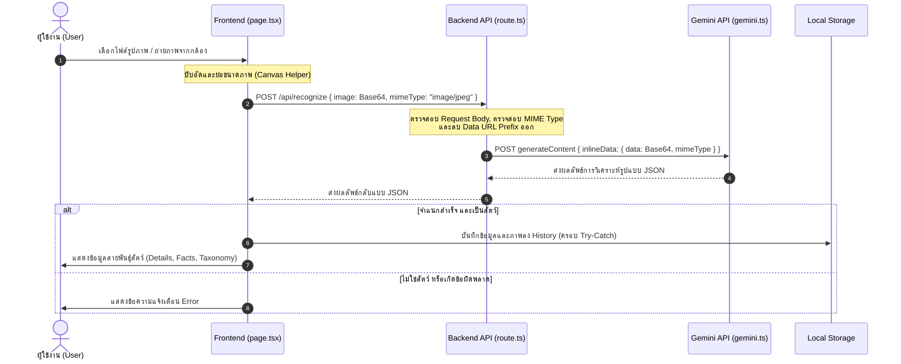

# ระบบอัพโหลดรูปภาพและวิเคราะห์สายพันธุ์สัตว์ (SmartZoo Image Upload System)

เอกสารฉบับนี้อธิบายการทำงานของระบบอัพโหลดและวิเคราะห์รูปภาพสัตว์ของหน้าเว็บ SmartZoo รวมถึงข้อผิดพลาดและการวิเคราะห์ปัญหาสำคัญที่ได้รับการแก้ไขเพื่อประสิทธิภาพและความเสถียรของระบบ

---

## 1. ลำดับขั้นตอนการทำงานของระบบ (Workflow)

การทำงานของระบบแบ่งออกเป็น 3 ส่วนหลัก ได้แก่:
1. **Frontend (React Client - [page.tsx](../app/page.tsx))**
2. **API Route Handler (Next.js Server - [route.ts](../app/api/recognize/route.ts))**
3. **AI Core (Gemini API Integration - [gemini.ts](../lib/gemini.ts))**



---

## 2. รายละเอียดการทำงานของแต่ละส่วน

### ส่วนที่ 1: Frontend Client (`app/page.tsx`)
* **การนำเข้าภาพ:** รองรับการอัปโหลดไฟล์ (File Upload) ผ่านทาง Input และการลากวาง (Drag and Drop) รวมถึงการถ่ายภาพจากกล้องสด (Camera Capture)
* **การบีบอัดและการแปลงรูปแบบภาพ:**
  - **สำหรับไฟล์อัปโหลด:** แปลงไฟล์ภาพแบบ Raw ด้วย `FileReader.readAsDataURL` แล้วส่งต่อให้ `compressAndResizeImage()` ทำการย่อขนาดให้กว้าง/ยาวสูงสุด 1000px และแปลงฟอร์แมตเป็น JPEG คุณภาพ 0.75 เพื่อลดขนาดไฟล์ลงเหลือ ~50KB - 150KB ก่อนประมวลผล
  - **สำหรับกล้อง:** วาดเฟรมภาพลง `<canvas>` และดึง Base64 Data URL ด้วยคุณภาพ 0.85 (JPEG) จากนั้นส่งวิเคราะห์
* **การเรียก API:** ส่ง Request ผ่าน Fetch API ไปที่ `/api/recognize` โดยใช้ POST method พร้อมระบุ payload เป็น `{ image: base64Data, mimeType: file.type }`
* **ระบบประวัติ (Scan History Gallery):** บันทึกประวัติการสแกนสูงสุด 20 รายการล่าสุด โดยใช้ `localStorage.setItem("animal_scan_history", JSON.stringify(updatedHistory))` ภายใต้บล็อก Try-Catch และระบบลดทอนพื้นที่อัตโนมัติ

### ส่วนที่ 2: API Route Handler (`app/api/recognize/route.ts`)
* ทำหน้าที่เป็น Proxy ระหว่าง Frontend และ Gemini API เพื่อปกป้อง API Key ไม่ให้รั่วไหลไปฝั่ง Client
* ดึงค่า `image` และ `mimeType` ออกจาก Request body
* ทำการตรวจสอบความถูกต้องของประเภทไฟล์ภาพ (MIME Type Validation)
* ดึงค่า MIME Type จาก Data URL อัตโนมัติเป็นกรณี Fallback
* ทำความสะอาด (Clean) ค่า Base64 โดยตัด prefix `data:image/...;base64,` ออกโดยการใช้คำสั่ง split (เอาเฉพาะส่วน Base64 เพียวๆ)
* ส่ง Base64 ที่ทำความสะอาดแล้วและ mimeType ไปประมวลผลที่ฟังก์ชัน `analyzeAnimal()` ใน `lib/gemini.ts`

### ส่วนที่ 3: Gemini API Integration (`lib/gemini.ts`)
* เรียกใช้โมเดล `gemini-2.5-flash` ผ่าน REST API endpoint
* กำหนด `generationConfig` ให้ทำงานในโหมด Structured JSON Response (`responseMimeType: "application/json"`)
* ส่งภาพเป็น `inlineData` และจำแนกตามโครงสร้าง `responseSchema` ที่กำหนดไว้อย่างเข้มงวด (ประกอบด้วย `isAnimal`, `nameTh`, `nameEn`, `scientificName`, `conservationStatus`, `description`, `habitat`, `diet`, `lifespan`, `funFacts`)

---

## 3. ปัญหาที่พบและได้รับการแก้ไขแล้วทั้งหมด (Fixed Issues) ✅

จากการตรวจสอบโค้ดและการใช้งานจริง ระบบได้รับการปรับปรุงและแก้ไขจุดเสี่ยงสำคัญ 4 ประการเรียบร้อยแล้ว ดังนี้:

### 🟢 1. แก้ไขปัญหา: แอปพลิเคชันล่มจากการเก็บ Base64 ขนาดใหญ่ใน LocalStorage (`QuotaExceededError`)
* **ปัญหาเดิม:** การบันทึกประวัติจะนำภาพถ่าย Base64 ขนาดใหญ่จากไฟล์ดิบไปใส่ไว้ใน `localStorage` ตรง ๆ ทำให้พื้นที่ของเบราว์เซอร์เต็ม (เกิน 5MB) และโยน Error ขัดขวาง JavaScript ตัวอื่น ๆ
* **การแก้ไข:** 
  1. ใช้ฟังก์ชันย่อขนาดภาพฝั่ง Frontend ทำให้ภาพที่จัดเก็บในประวัติมีขนาดเล็กลงมาก (เหลือ ~50KB - 150KB ต่อภาพ)
  2. ครอบคำสั่ง `try...catch` ล้อมรอบคำสั่งบันทึกประวัติ หากตรวจพบ Error พื้นที่เต็ม (`QuotaExceededError`) ระบบจะสไลซ์ประวัติเก่าทิ้งให้เหลือ 5 รายการล่าสุดโดยอัตโนมัติเพื่อคืนพื้นที่เก็บข้อมูลทันที

### 🟢 2. แก้ไขปัญหา: ความเร็วในการอัปโหลดต่ำและข้อผิดพลาด Payload Size Limit ฝั่ง Server
* **ปัญหาเดิม:** การส่งรูปภาพไฟล์ขนาด 5MB - 12MB ขึ้นไปผ่านอินเทอร์เน็ตสร้างคอขวดแบนด์วิดท์ และทำให้ Server ปฏิเสธ Request ด้วย Error `413 Payload Too Large` (เช่น ขีดจำกัด 4.5MB ของ Vercel)
* **การแก้ไข:** เพิ่มฟังก์ชัน `compressAndResizeImage` ในการประมวลผลก่อนส่งไปวิเคราะห์ เพื่อย่อรูปภาพให้สมมาตรโดยกว้างหรือยาวไม่เกิน 1,000 พิกเซล และเซฟเป็น JPEG คุณภาพ 0.75 ช่วยลดขนาดข้อมูลที่อัปโหลดได้มากกว่า 90% และไม่มีปัญหา Payload เกินขีดจำกัดอีกต่อไป

### 🟢 3. แก้ไขปัญหา: การกดวิเคราะห์ซ้ำจากประวัติการสแกนแล้วขึ้น Error `Missing 'image' or 'mimeType'`
* **ปัญหาเดิม:** ข้อมูลที่เซฟลงใน LocalStorage ไม่มีฟิลด์ `mimeType` เมื่อคลิกโหลดประวัติภาพเก่าขึ้นมาดูและกดวิเคราะห์ซ้ำ ค่า `mimeType` ที่ส่งไปฝั่ง Server จะว่างเปล่า (`""`) ทำให้โดนบล็อกที่ Validation บน API Server
* **การแก้ไข:** ปรับปรุงทั้ง Frontend และ Backend ให้ตรวจหาและดึงค่า MIME Type จาก Base64 Data URL โดยอัตโนมัติ (เช่น แกะ `image/jpeg` จาก `data:image/jpeg;base64...`) ทำให้วิเคราะห์ซ้ำได้อย่างสมบูรณ์

### 🟢 4. แก้ไขปัญหา: ขาดการตรวจสอบความถูกต้องของประเภทไฟล์ภาพฝั่ง Server (Server-side Validation)
* **ปัญหาเดิม:** API `/api/recognize` รับข้อมูลและส่งต่อให้ Gemini API ทันทีโดยไม่มีการเช็กรูปแบบไฟล์ หากมีการส่งรูปแบบที่ไม่รองรับจะไปเกิด Error ที่ปลายทางด้านนอกแทนที่จะสกัดกั้นตั้งแต่แรก
* **การแก้ไข:** เพิ่มระบบตรวจสอบ MIME Type ในระดับ API Server ([route.ts](../app/api/recognize/route.ts)) เพื่อตรวจสอบและอนุญาตเฉพาะรูปแบบที่ระบุในรายการ (`image/jpeg`, `image/jpg`, `image/png`, `image/webp`, `image/heic`, `image/heif`) หากไม่ตรงเงื่อนไขจะส่งข้อความแจ้งเตือน `400 Bad Request` ปฏิเสธกลับไปโดยเร็วที่สุด

---

## 4. ปัญหาเพิ่มเติมที่อาจเกิดขึ้นได้ในอนาคต (Potential Future Vulnerabilities & Edge Cases) 🔮

แม้ว่าเราจะแก้ปัญหาหลักไปแล้ว แต่จากการสแกนโค้ดเชิงลึกยังพบจุดเสี่ยงและ Edge Cases ที่อาจเกิดขึ้นได้อีก 4 ประการ ดังนี้:

### 🔴 ปัญหาที่ 1: ทรัพยากรกล้องรั่วไหลเมื่อเปลี่ยนหน้าเว็บ (Camera Stream Leak)
* **สาเหตุ:** ในไฟล์ [page.tsx](../app/page.tsx) มีปุ่ม "เปิดกล้องสด" ซึ่งเรียกใช้คำสั่ง `navigator.mediaDevices.getUserMedia` และเก็บสตรีมไว้ในสถานะ `stream` อย่างไรก็ตาม ใน `useEffect` ของไฟล์นี้ไม่มีโค้ดสำหรับ Cleanup เพื่อสั่งหยุดทำงานของกล้องเมื่อคอมโพเนนต์ย้ายหน้าออก (Unmount)
* **ผลกระทบ:** หากผู้ใช้งานกำลังเปิดใช้โหมดกล้องสดอยู่ แล้วคลิกเปลี่ยนหน้าเว็บไปยังหน้า "/about" หรือหน้าอื่น ๆ ผ่านแถบเมนู (Client-side Navigation) **กล้องของอุปกรณ์จะยังคงเปิดค้างและทำงานอยู่เบื้องหลังตลอดเวลา** (ไฟกล้องสีเขียวไม่ดับ) ส่งผลให้แบตเตอรี่โทรศัพท์/คอมพิวเตอร์หมดลงอย่างรวดเร็ว และเกิดความกังวลด้านความเป็นส่วนตัว (Privacy) ของผู้ใช้
* **แนวทางแก้ไข:** เพิ่ม Cleanup ฟังก์ชันใน `useEffect` หรือดักตรวจการ Unmount เพื่อสั่งปิดสตรีมและแทร็กของกล้องทั้งหมดทันที:
  ```typescript
  useEffect(() => {
    return () => {
      // สั่งหยุดทำงานของกล้องเมื่อออกจากหน้านี้
      if (stream) {
        stream.getTracks().forEach((track) => track.stop());
      }
    };
  }, [stream]);
  ```

### 🔴 ปัญหาที่ 2: หน้าเว็บล่มเมื่อข้อมูลสัตว์บางฟิลด์ถูกข้ามหรือส่งเป็นค่าว่างจาก AI (UI Crash due to Schema Instability)
* **สาเหตุ:** ในส่วนแสดงผลผลลัพธ์ของไฟล์ [page.tsx](../app/page.tsx) มีการเรียกใช้ข้อมูลที่คาดว่าจะมาครบตามโครงสร้าง เช่น `{result.funFacts.map(...)}` แต่ในความจริง โมเดล AI (แม้จะระบุ Schema ก็ตาม) อาจส่งค่าบางฟิลด์กลับมาเป็น `undefined`, `null` หรือฟิลด์หายไปได้ในกรณีที่ภาพถ่ายเบลอมาก หรือระบบ Safety Filters ของ Google ตรวจพบอะไรบางอย่าง
* **ผลกระทบ:** หากตัวแปร `funFacts` หรือฟิลด์ข้อมูลอื่น ๆ ไม่มีข้อมูลส่งกลับมา เบราว์เซอร์จะโยน Error `TypeError: Cannot read properties of undefined (reading 'map')` ส่งผลให้หน้าจอขาวโพลน หรือหน้าเว็บล่มทั้งหน้าทันที
* **แนวทางแก้ไข:** ใช้ Optional Chaining และมีตัวเลือก Fallback เสมอ เช่น:
  ```typescript
  // ใช้ ?. และมีค่าเริ่มต้นเป็นอาร์เรย์ว่าง
  {(result.funFacts || []).map((fact, i) => (
  ```

### 🟡 ปัญหาที่ 3: ปัญหาการส่งคำขอชนกันเมื่อส่งภาพอัปโหลดถี่ ๆ (Race Conditions)
* **สาเหตุ:** การย่อภาพด้วย Canvas ฝั่ง Client มีความเร็วในระดับหนึ่งแต่ทำงานแบบ Asynchronous หากผู้ใช้งานกดยืนยันอัปโหลดภาพที่ 1 และกดยืนยันอัปโหลดภาพที่ 2 ตามทันทีในจังหวะกระชั้นชิด
* **ผลกระทบ:** คำสั่งวิเคราะห์ภาพจะทำงานซ้อนทับกัน และผลลัพธ์สุดท้ายที่แสดงบนหน้าเว็บ (State `result` และ `image`) อาจสลับลำดับกันได้ ส่งผลให้แสดงข้อมูลไม่ตรงกับรูปภาพปัจจุบันบนหน้าจอ
* **แนวทางแก้ไข:** ควรมีระบบปิดการทำงานของปุ่มหรือแสดง Overlay ป้องกันไม่ให้ผู้ใช้อัปโหลดภาพใหม่ในระหว่างที่ระบบกำลังประมวลผลไฟล์ก่อนหน้าอยู่ (`analyzing === true`)

### 🟡 ปัญหาที่ 4: การยิงถล่ม API และค่าบริการบานปลาย (API Spam / Lack of Rate Limiting)
* **สาเหตุ:** API Route `/api/recognize` ทำหน้าที่เป็นจุดส่งต่อข้อมูลไปยัง Gemini API ซึ่งมีค่าบริการคำนวณตามปริมาณใช้งาน โดยในปัจจุบันโค้ดยังไม่มีตัวตรวจสอบความถี่ในการส่งคำขอ (Rate Limiting) ใด ๆ
* **ผลกระทบ:** ผู้ไม่หวังดีสามารถใช้บอทเพื่อทำการส่ง Request ภาพขนาดใหญ่เข้ามาที่ API `/api/recognize` ซ้ำ ๆ ได้อย่างไม่จำกัด ส่งผลให้เครื่องเซิร์ฟเวอร์ทำงานหนัก และทำให้โควตาการใช้งาน Gemini API หมดลงอย่างรวดเร็วหรือมีภาระค่าใช้จ่ายที่ควบคุมไม่ได้
* **แนวทางแก้ไข:** การติดตั้งระบบจำกัดจำนวนรีเควส (เช่น `next-rate-limit` หรือระบบตรวจเช็ก IP) ในระดับ API Route เพื่อให้ส่งคำขอได้สูงสุดไม่เกินที่กำหนด (เช่น 10 ครั้งต่อนาทีต่อหนึ่งไอพี)

---

## 5. แนวทางการแก้ไขปัญหาที่แนะนำสำหรับการปรับปรุงทั่วไป

นอกจากประเด็นในส่วนที่ 4 แล้ว โค้ดควรได้รับการแก้ไขด้วยแนวทางเหล่านี้:

### 1. ระบบจัดการกล้องที่ปลอดภัย
ปรับปรุงฟังก์ชัน Cleanup เพื่อป้องกันการรั่วไหลของแบตเตอรี่และไฟสถานะกล้อง

### 2. การเพิ่มเงื่อนไขความปลอดภัยให้กับ UI (Defensive Coding)
ใช้คุณสมบัติ Safe Navigation (`?.`) ใน React UI ทุกจุดที่รับข้อมูลที่ได้มาจากการประมวลผลภายนอกหรือระบบที่อาจเกิดความไม่แน่นอน
